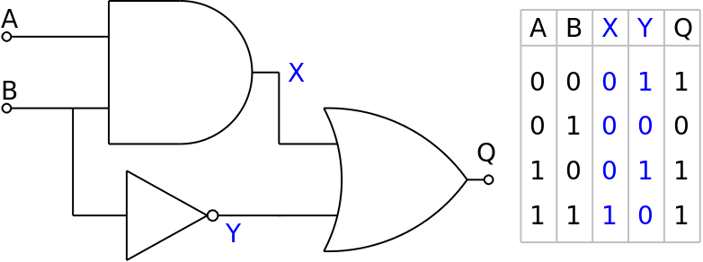

# zkSNARK Circuit - MetaCrafters

This project deals with coding a custom circuit using circom and deploying it to testnet

## Description

This project implements the below circuit using circom code and deployed to Sepolia Testnet.

## Getting Started

### Install
`npm i`

### Compile
`npx hardhat circom` 
This will generate the **out** file with circuit intermediaries and geneate the **MultiplierVerifier.sol** contract

### Prove and Deploy
`npx hardhat run scripts/deploy.ts`
This script does 4 things  
1. Deploys the MultiplierVerifier.sol contract
2. Generates a proof from circuit intermediaries with `generateProof()`
3. Generates calldata with `generateCallData()`
4. Calls `verifyProof()` on the verifier contract with calldata

With two commands you can compile a ZKP, generate a proof, deploy a verifier, and verify the proof 🎉

## Deployed contract

The contract has been deployed in Sepolia Testnet and verified: [0x70ad3Fd4a6751db53937ef2bcF18fda12D6c580f](https://sepolia.etherscan.io/address/0xe08B9Ce19Fcf09bBC936731B5107202D48E4C91D#code)

## Authors

A Dhruva Krishnama Raju
[@adhruva2002](https://x.com/adhruva2002)